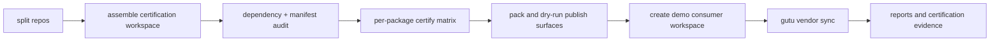

# gutu-ecosystem-integration

<p align="center">
  
</p>

Cross-repo certification harness for the split Gutu ecosystem.

This repository assembles `gutu-core`, extracted plugin repos, extracted library repos, and app repos into a temporary certification workspace so we can verify the ecosystem the way a real adopter experiences it.

## Why This Repo Exists

| Question | Answer |
| --- | --- |
| What does it prove? | That the split ecosystem installs, builds, tests, packages, and vendor-syncs the way the docs claim it does. |
| Why does it matter? | Multi-repo frameworks often look clean on paper but break when a consumer tries to assemble them end to end. |
| How is Gutu different? | This repo turns “integration confidence” into a repeatable artifact, not a hopeful assumption. |

## What It Verifies

- dependency-closure audit across extracted libraries, plugins, and apps
- compatibility-shim coverage for legacy `@platform/*` contracts that are not yet their own source repos
- workspace install across the assembled ecosystem
- per-package `lint`, `typecheck`, `test`, and `build` scripts when present
- npm publication smoke checks with `npm pack --dry-run`
- consumer-workspace scaffolding and `gutu vendor sync` using real package artifacts

## Consumer Journey Simulation



## Commands

```bash
bun install
bun run audit
bun run certify
bun run consumer:smoke
bun run ci
```

Generated reports are written to `reports/`.
